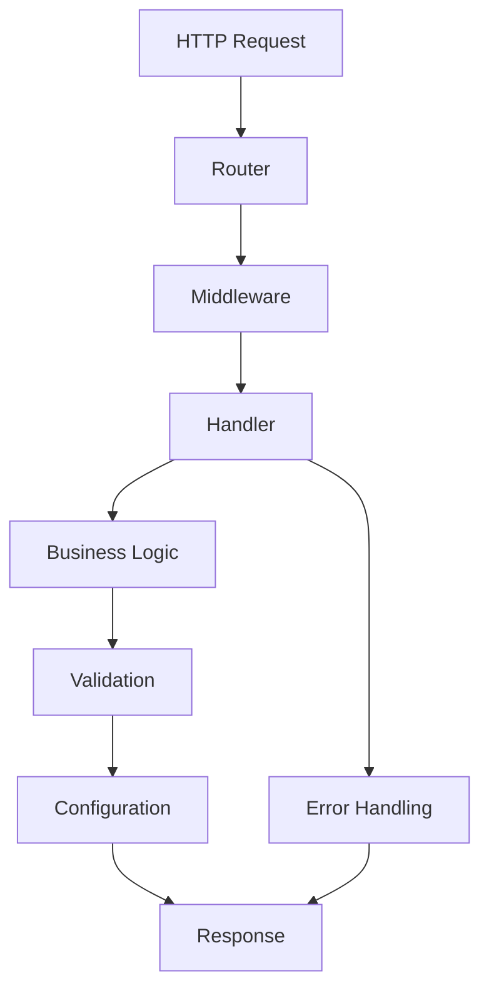

# error_handling - Essential Framework Components

## 🎯 Purpose
Provide structured error handling and conversion

📖 **For detailed error conversion patterns and best practices, see [conversion_guide.md](conversion_guide.md)**

## 📋 Overview
This module is part of the **matrix** project, built with the Invisible Matrix architecture pattern using:
- ⚡ **Axum** - Fast, safe, async Rust web framework
- 🎨 **Tailwind CSS** - Utility-first CSS framework  
- 🏔️ **Alpine.js** - Lightweight JavaScript framework
- 🚀 **Alpine AJAX** - Server-controlled AJAX interactions

## 🔗 Dependencies & Relationships
This module is self-contained with no external dependencies.

---

## 🤖 AI Agent Instructions

### Context
- **Purpose**: Provide structured error handling and conversion
- **Module Type**: ESSENTIAL
- **Primary Responsibility**: Provide core framework functionality and structure
- **Inputs**: HTTP requests, configuration, application state
- **Outputs**: HTTP responses, processed data, application state changes
- **Side Effects**: State changes, logging, request processing

### Implementation Patterns
- **Primary Pattern**: Layered architecture with handler/service separation
- **Error Handling**: Result types with structured error conversion
- **Testing Strategy**: Unit tests with integration testing for handlers
- **Dependencies**: 

### Integration Points
- **Database**: Repository pattern integration
- **External APIs**: HTTP client usage
- **Frontend**: Template rendering with Alpine.js
- **Cache**: Performance optimization layer

### Code Examples
```rust
// Essential handler example
use axum::{routing::get, Router, Json};
use serde_json::Value;

pub fn create_router() -> Router {
    Router::new()
        .route("/", get(home_handler))
        .route("/api/status", get(status_handler))
}

async fn home_handler() -> &'static str {
    "Welcome to matrix"
}

async fn status_handler() -> Json<Value> {
    Json(serde_json::json!({"status": "ok", "service": "matrix"}))
}
```

### Common Tasks
1. **Adding new route**: Add to router.rs, create handler in handlers/
2. **Adding middleware**: Implement in routing/middleware.rs
3. **Business logic**: Add service in business_logic/services/
4. **Error handling**: Use error_handling/types.rs patterns

---

## 📊 Architecture Diagrams

### Component Structure
```
┌─────────────────────────────────────────────────────────────┐
│                    matrix - Essential Components                    │
├─────────────────────────────────────────────────────────────┤
│                                                             │
│  ┌─────────────┐    ┌──────────────┐    ┌─────────────────┐ │
│  │   Handlers  │───▶│   Routing    │───▶│ Business Logic  │ │
│  │             │    │              │    │                 │ │
│  │ • home.rs   │    │ • router.rs  │    │ • services/     │ │
│  │ • api.rs    │    │ • middleware │    │ • data/         │ │
│  └─────────────┘    └──────────────┘    └─────────────────┘ │
│         │                   │                      │        │
│         ▼                   ▼                      ▼        │
│  ┌─────────────┐    ┌──────────────┐    ┌─────────────────┐ │
│  │ Validation  │    │Configuration │    │ Error Handling  │ │
│  │             │    │              │    │                 │ │
│  │ • validators│    │ • config.rs  │    │ • types.rs      │ │
│  │ • sanitizers│    │ • sources/   │    │ • conversion.rs │ │
│  └─────────────┘    └──────────────┘    └─────────────────┘ │
│                                                             │
└─────────────────────────────────────────────────────────────┘
```

### Data Flow


### Dependencies
```
error_handling
├── Dependencies
│   ├── axum (web framework)
│   ├── tokio (async runtime)
│   ├── serde (serialization)
│   └── anyhow (error handling)
│
├── Internal Dependencies

│
└── External Dependencies
    ├── Database (PostgreSQL/SQLite)
    ├── Cache (Redis/Memory)
    └── External APIs
```

---

## 👨‍💻 Developer Guide

### Quick Start
1. **Setup**: Ensure all dependencies are installed
2. **Configuration**: Update configuration files as needed
3. **Integration**: Follow the integration patterns below
4. **Testing**: Run tests to verify functionality

```bash
# Install dependencies
npm install

# Start development server
./scripts/dev.sh

# Run tests
cargo test error_handling
```

### Best Practices
- **Error Handling**: Always use Result<T, Error> for fallible operations
- **Async/Await**: Use async functions for I/O operations
- **Testing**: Write tests for all public interfaces
- **Documentation**: Keep README updated with changes
- **Security**: Validate all inputs and sanitize outputs
- **Performance**: Use caching and connection pooling where appropriate

### Common Pitfalls
- **Blocking Operations**: Don't use blocking I/O in async contexts
- **Error Swallowing**: Always handle or propagate errors appropriately
- **Resource Leaks**: Ensure proper cleanup of connections and resources
- **Security**: Don't trust user input without validation
- **Performance**: Avoid N+1 queries and excessive allocations
- **Testing**: Don't skip integration tests for external dependencies

### Testing Patterns
```rust
#[cfg(test)]
mod tests {
    use super::*;
    
    #[tokio::test]
    async fn test_service_functionality() {
        let service = Service::new();
        let result = service.process().await;
        assert!(result.is_ok());
    }
}
```

---

## 📁 Directory Structure

```
error_handling
├── mod.rs              # Module exports and public interface
├── types.rs            # Data structures and type definitions
├── handlers.rs         # Request handlers and business logic
├── services.rs         # Core service implementations
├── utils.rs            # Utility functions and helpers
└── tests.rs            # Unit and integration tests
```

### File Purposes
- **mod.rs**: Public interface and module exports
- **types.rs**: Data structures and type definitions  
- **handlers.rs**: HTTP request handlers and routing logic
- **services.rs**: Core business logic and service implementations
- **utils.rs**: Utility functions and helper methods
- **tests.rs**: Unit and integration tests for the error_handling module

---

## 🔧 Quick Implementation

### Minimal Working Example
```rust
use axum::{routing::get, Router};

#[tokio::main]
async fn main() {
    let app = Router::new()
        .route("/", get(|| async { "Hello from matrix!" }));
    
    let listener = tokio::net::TcpListener::bind("0.0.0.0:3000").await.unwrap();
    axum::serve(listener, app).await.unwrap();
}
```

### Integration with Axum
```rust
use axum::{routing::get, Router, Json};
use tower_http::services::ServeDir;

pub fn create_app() -> Router {
    Router::new()
        .route("/", get(home_handler))
        .route("/api/health", get(health_handler))
        .nest_service("/assets", ServeDir::new("assets"))
}

async fn home_handler() -> &'static str {
    "Welcome to Invisible Matrix!"
}

async fn health_handler() -> Json<serde_json::Value> {
    Json(serde_json::json!({"status": "healthy"}))
}
```

### Frontend Integration (Alpine.js + Alpine AJAX)
```html
<!-- Alpine.js + Alpine AJAX Integration -->
<div x-data="{}" class="container mx-auto p-4">
    <h1 class="text-2xl font-bold mb-4">error_handling Module</h1>
    
    <!-- Alpine AJAX powered interaction -->
    <button 
        x-sync="/api/error_handling"
        x-target="#result"
        class="btn btn-primary">
        Load error_handling Data
    </button>
    
    <!-- Results area -->
    <div id="result" class="mt-4 p-4 bg-gray-100 rounded">
        <!-- Content will be loaded here -->
    </div>
</div>
```

### Styling with Tailwind
```css
/* error_handling Module Styles */

/* Component styles */
.error_handling-container {
  @apply max-w-4xl mx-auto p-6 bg-white rounded-lg shadow-md;
}

.error_handling-header {
  @apply text-3xl font-bold text-gray-900 mb-6 border-b pb-4;
}

.error_handling-content {
  @apply prose prose-lg max-w-none;
}

/* Interactive elements */
.error_handling-button {
  @apply px-4 py-2 bg-blue-600 text-white rounded-md hover:bg-blue-700 
         focus:ring-2 focus:ring-blue-500 focus:ring-offset-2 
         transition-colors duration-200;
}

/* Status indicators */
.error_handling-status-success {
  @apply px-3 py-1 bg-green-100 text-green-800 rounded-full text-sm font-medium;
}

.error_handling-status-error {
  @apply px-3 py-1 bg-red-100 text-red-800 rounded-full text-sm font-medium;
}
```

---

## 📚 Additional Resources

- [Invisible Matrix Architecture](../../../docs/architecture.md)
- [Axum Documentation](https://docs.rs/axum)
- [Alpine.js Guide](https://alpinejs.dev)
- [Alpine AJAX Reference](https://alpine-ajax.js.org)
- [Tailwind CSS Docs](https://tailwindcss.com)

## 🤝 Contributing

When modifying this module:
1. Update this README with any architectural changes
2. Add tests for new functionality
3. Update integration examples
4. Verify AI agent instructions remain accurate
5. Test with the full tech stack (Axum + Tailwind + Alpine + Alpine AJAX)

---

*Generated by imcli - Invisible Matrix CLI*
