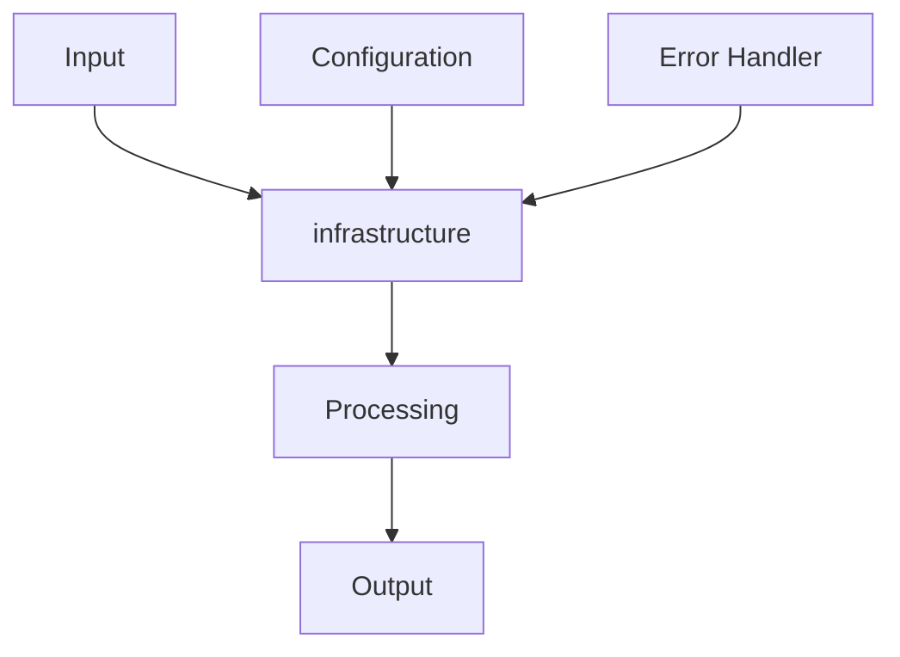

# infrastructure - Infrastructure Components

## 🎯 Purpose
Handle external integrations and infrastructure concerns

## 📋 Overview
This module is part of the **infrastructure** project, built with the Invisible Matrix architecture pattern using:
- ⚡ **Axum** - Fast, safe, async Rust web framework
- 🎨 **Tailwind CSS** - Utility-first CSS framework  
- 🏔️ **Alpine.js** - Lightweight JavaScript framework
- 🚀 **Alpine AJAX** - Server-controlled AJAX interactions

## 🔗 Dependencies & Relationships
This module is self-contained with no external dependencies.

---

## 🤖 AI Agent Instructions

### Context
- **Purpose**: Handle external integrations and infrastructure concerns
- **Module Type**: INFRASTRUCTURE
- **Primary Responsibility**: Manage external dependencies and system resources
- **Inputs**: Connection strings, API keys, resource configurations
- **Outputs**: Database connections, API responses, system resources
- **Side Effects**: External API calls, database connections, resource allocation

### Implementation Patterns
- **Primary Pattern**: Repository pattern with dependency injection
- **Error Handling**: Connection errors with retry logic and fallbacks
- **Testing Strategy**: Integration tests with external service mocking
- **Dependencies**: 

### Integration Points
- **Database**: Connection pooling and migrations
- **External Services**: API clients with retry logic
- **File System**: Asset and upload management
- **Cache**: Redis and in-memory caching

### Code Examples
```rust
// infrastructure module example
use anyhow::Result;

pub struct infrastructureService {
    // Service dependencies
}

impl infrastructureService {
    pub fn new() -> Self {
        Self {}
    }
    
    pub async fn process(&self) -> Result<()> {
        // Implementation here
        Ok(())
    }
}
```

### Common Tasks
1. **Adding new functionality**: Follow the established patterns
2. **Error handling**: Use Result<T, Error> consistently
3. **Testing**: Write unit tests for all public functions
4. **Integration**: Follow dependency injection patterns

---

## 📊 Architecture Diagrams

### Component Structure
```
┌─────────────────────────────────────────────────────────────┐
│                      infrastructure Module                               │
├─────────────────────────────────────────────────────────────┤
│                                                             │
│  ┌─────────────┐    ┌──────────────┐    ┌─────────────────┐ │
│  │   Input     │───▶│  Processing  │───▶│     Output      │ │
│  │             │    │              │    │                 │ │
│  │ • Requests  │    │ • Business   │    │ • Responses     │ │
│  │ • Data      │    │   Logic      │    │ • Results       │ │
│  └─────────────┘    └──────────────┘    └─────────────────┘ │
│                                                             │
└─────────────────────────────────────────────────────────────┘
```

### Data Flow


### Dependencies
```
infrastructure
├── Dependencies
│   ├── axum (web framework)
│   ├── tokio (async runtime)
│   ├── serde (serialization)
│   └── anyhow (error handling)
│
├── Internal Dependencies

│
└── External Dependencies
    ├── Database (PostgreSQL/SQLite)
    ├── Cache (Redis/Memory)
    └── External APIs
```

---

## 👨‍💻 Developer Guide

### Quick Start
1. **Setup**: Ensure all dependencies are installed
2. **Configuration**: Update configuration files as needed
3. **Integration**: Follow the integration patterns below
4. **Testing**: Run tests to verify functionality

```bash
# Install dependencies
npm install

# Start development server
./scripts/dev.sh

# Run tests
cargo test infrastructure
```

### Best Practices
- **Error Handling**: Always use Result<T, Error> for fallible operations
- **Async/Await**: Use async functions for I/O operations
- **Testing**: Write tests for all public interfaces
- **Documentation**: Keep README updated with changes
- **Security**: Validate all inputs and sanitize outputs
- **Performance**: Use caching and connection pooling where appropriate

### Common Pitfalls
- **Blocking Operations**: Don't use blocking I/O in async contexts
- **Error Swallowing**: Always handle or propagate errors appropriately
- **Resource Leaks**: Ensure proper cleanup of connections and resources
- **Security**: Don't trust user input without validation
- **Performance**: Avoid N+1 queries and excessive allocations
- **Testing**: Don't skip integration tests for external dependencies

### Testing Patterns
```rust
#[cfg(test)]
mod tests {
    use super::*;
    
    #[tokio::test]
    async fn test_service_functionality() {
        let service = Service::new();
        let result = service.process().await;
        assert!(result.is_ok());
    }
}
```

---

## 📁 Directory Structure

```
infrastructure
├── mod.rs              # Module exports and public interface
├── types.rs            # Data structures and type definitions
├── handlers.rs         # Request handlers and business logic
├── services.rs         # Core service implementations
├── utils.rs            # Utility functions and helpers
└── tests.rs            # Unit and integration tests
```

### File Purposes
- **mod.rs**: Public interface and module exports
- **types.rs**: Data structures and type definitions  
- **handlers.rs**: HTTP request handlers and routing logic
- **services.rs**: Core business logic and service implementations
- **utils.rs**: Utility functions and helper methods
- **tests.rs**: Unit and integration tests for the infrastructure module

---

## 🔧 Quick Implementation

### Minimal Working Example
```rust
// Minimal infrastructure implementation
pub struct infrastructure {
    // Configuration
}

impl infrastructure {
    pub fn new() -> Self {
        Self {}
    }
    
    pub async fn execute(&self) -> anyhow::Result<()> {
        // Implementation
        Ok(())
    }
}
```

### Integration with Axum
```rust
use axum::{routing::get, Router, Extension};

pub fn configure_routes() -> Router {
    Router::new()
        .route("/infrastructure", get(infrastructure_handler))
        .layer(Extension(infrastructure::new()))
}

async fn infrastructure_handler(Extension(service): Extension<infrastructure>) -> String {
    // Handler implementation
    format!("infrastructure service response")
}
```

### Frontend Integration (Alpine.js + Alpine AJAX)
```html
<!-- Alpine.js + Alpine AJAX Integration -->
<div x-data="{}" class="container mx-auto p-4">
    <h1 class="text-2xl font-bold mb-4">infrastructure Module</h1>
    
    <!-- Alpine AJAX powered interaction -->
    <button 
        x-sync="/api/infrastructure"
        x-target="#result"
        class="btn btn-primary">
        Load infrastructure Data
    </button>
    
    <!-- Results area -->
    <div id="result" class="mt-4 p-4 bg-gray-100 rounded">
        <!-- Content will be loaded here -->
    </div>
</div>
```

### Styling with Tailwind
```css
/* infrastructure Module Styles */

/* Component styles */
.infrastructure-container {
  @apply max-w-4xl mx-auto p-6 bg-white rounded-lg shadow-md;
}

.infrastructure-header {
  @apply text-3xl font-bold text-gray-900 mb-6 border-b pb-4;
}

.infrastructure-content {
  @apply prose prose-lg max-w-none;
}

/* Interactive elements */
.infrastructure-button {
  @apply px-4 py-2 bg-blue-600 text-white rounded-md hover:bg-blue-700 
         focus:ring-2 focus:ring-blue-500 focus:ring-offset-2 
         transition-colors duration-200;
}

/* Status indicators */
.infrastructure-status-success {
  @apply px-3 py-1 bg-green-100 text-green-800 rounded-full text-sm font-medium;
}

.infrastructure-status-error {
  @apply px-3 py-1 bg-red-100 text-red-800 rounded-full text-sm font-medium;
}
```

---

## 📚 Additional Resources

- [Invisible Matrix Architecture](../../../docs/architecture.md)
- [Axum Documentation](https://docs.rs/axum)
- [Alpine.js Guide](https://alpinejs.dev)
- [Alpine AJAX Reference](https://alpine-ajax.js.org)
- [Tailwind CSS Docs](https://tailwindcss.com)

## 🤝 Contributing

When modifying this module:
1. Update this README with any architectural changes
2. Add tests for new functionality
3. Update integration examples
4. Verify AI agent instructions remain accurate
5. Test with the full tech stack (Axum + Tailwind + Alpine + Alpine AJAX)

---

*Generated by imcli - Invisible Matrix CLI*
